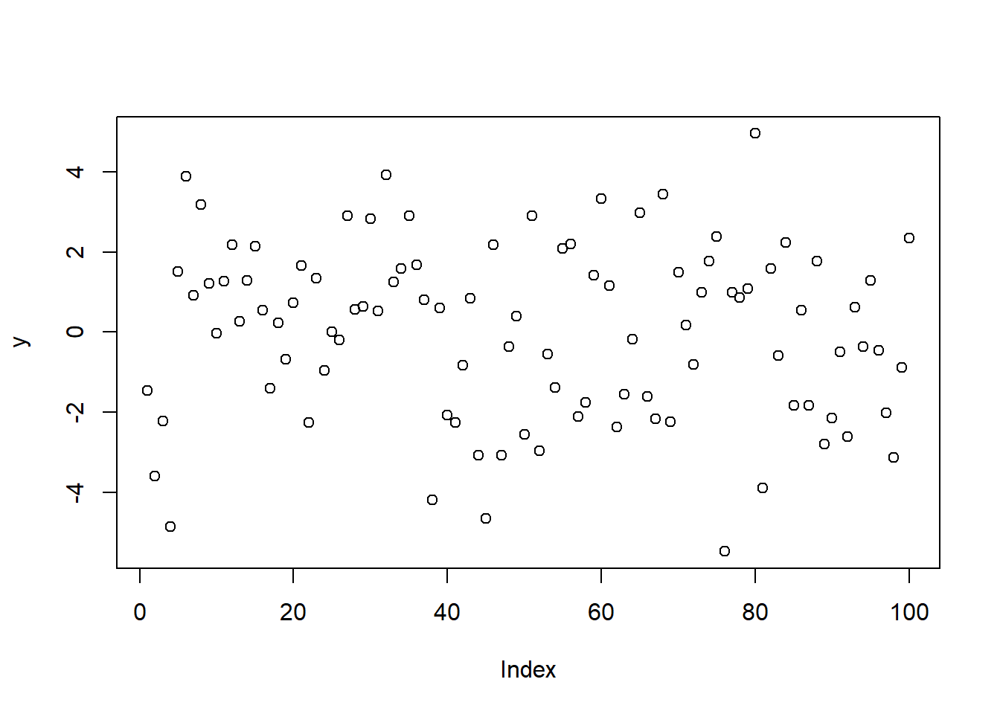
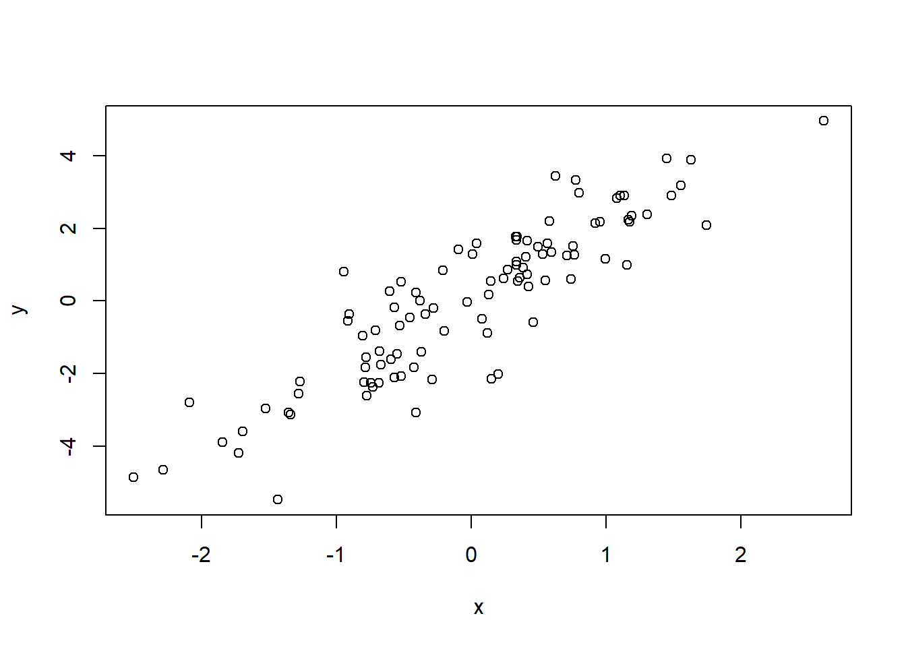
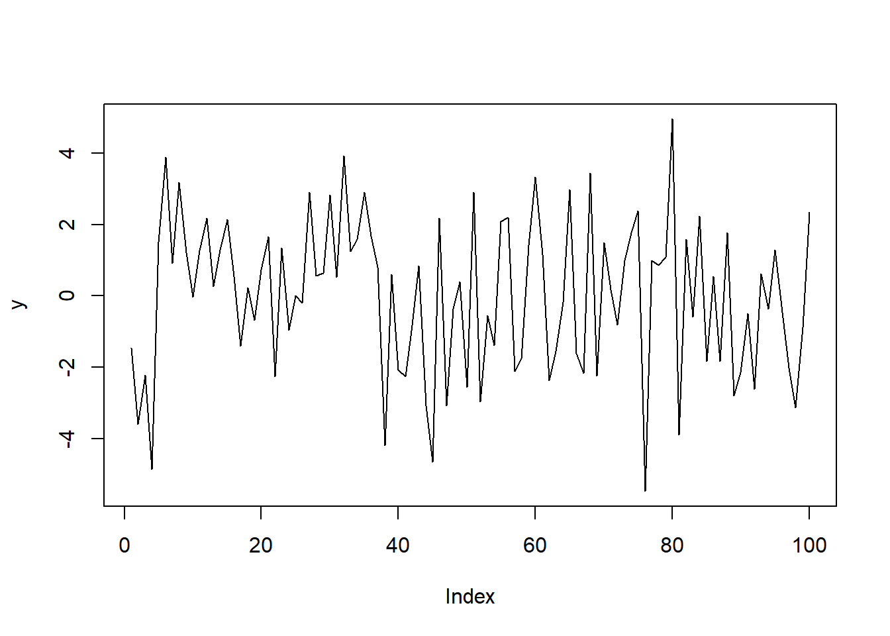

#Apresentando os resultados

Os milhares de modelos que você rodou são tão úteis quanto a sua capacidade de apresentar eles. Sem sermos capazes de apresentar os resultados, nosso trabalho é estéril. Este capítulo apresenta algumas maneiras de usar o R para apresentar resultados. 

##Tabelas

Feitas as regressões, precisamos apesentar os resultados. Você sempre pode copiar e colar o sumário do R, mas convenhamos: ele é feio. Podemos digitar na mão, mas isto é trabalhoso. A boa notícia é que alguns pacotes do R ajudam ao criar tabelas. Damos atenção a dois: o **stargazer** e o **xtable**.

A má notícia é que esses dois pacotes não geram tabelas para o Word. Eles geram tabelas para LaTeX e para html. LaTeX é uma linguagem muito popular para escrever artigos científicos e livros - este manual foi, originalmente, escrito em LaTeX; já html é a linguagem padrão para criar sites na internet, e é a base do Markdown, apresentado na próxima seção. O que vemos nos documentos como esse e como sites da internet são as versões compiladas. Tanto html, Markdown e LaTeX não são como o Word, que o que você vê é como vai ficar no documento final: ambas são, de certa forma, linguagens de programação para produzir textos. Há um comando para colocar as palavras em negrito, outro para itálico etc. 

Explicar como usar o LaTeX foge do escopo deste manual. Entretanto, o autor incentiva que o leitor aprenda LaTeX ou Markdown. O Markdown, que vai ser apresentado com mais detalhes na próxima seção, é um passo intermediário entre o R e o LaTeX, e pode facilitar imensamente o aprendizado do LaTeX. Alguns motivos para aprender LaTeX (e Markdown) é que (1) é mais fácil digitar equações, (2) fácil de integrar com o R, (3) uma vez que você aprende, é mais fácil que o Word, (4) os documentos em LaTeX são mais bonitos que os efeitos em Word. As referências no fim do manual trazem alguns links para os interessados em aprender LaTeX. 

O **xtable** converte tabelas do R para o formato LaTeX. Se você tem uma matriz de nome `matriz` e fizer `xtable(matriz)`, o R vai fornecer o código em LaTeX para fazer uma tabela com os elementos da `matriz`.  Já o **stargazer** apresenta o sumário da regressão em formato LaTeX (ou html) automaticamente. Suponha que você tenha um modelo chamado `modelo`. Usar `stargazer(modelo)` vai apresentar o sumário do modelo. O comando é altamente configurável, com uma infinidade de parâmetros; e funciona com vários pacotes e não só com comandos da base do R, como o `lm`. 

##Markdown

O Rstudio já vem com uma opção para trabalhar com arquivos markdown, e para criar um novo arquivo markdown basta ir no menu, new file, R Markdown. O R Markdown também depende de comandos para fazer as alterações no texto - por exemplo, itálico são asteriscos cercando o texto. Assim, se digitarmos no markdown `*itálico*`, o resultado final seria *itálico*. Isso pode parecer esquisito a primeira vista, mas uma vez criado o hábito, o comportamento é bem mais previsível que o word.   

O Markdown é mais fácil de usar que o LaTeX, mas tem menos opções. O Rstudio tem várias dicas de como usar o Markdown - basta olhar o help do Rstudio, ir na opção cheatsheets, e temos duas opções: R Markdown Cheatsheet e R Markdown Reference Guide. Ambos são úteis. Também no help temos o Markdown Quick Reference, que tem os principais comandos para o Markdown, e que abre na mesma janela que o help do R. 

Veja que ao criar um novo arquivo, ele dá várias opções: html, pdf, word. Se você escolher html, pode gerar um pdf ou arquivo word depois, *mas não o contrário*. Logo, escolha o html. Se você não fez nenhuma alteração na organização do RStudio, ele deve abrir em cima do console. Há várias opções na barra abaixo do nome do arquivo e a mais importante é o Knit: ele vai gerar o documento que você quer ver. Na primeira vez que você clicar nele, você vai ter que salvar o arquivo: dê um nome e não esqueça de colocar a extensão .Rmd. Assim, se o arquivo se chama relatório, você deve salvar como relatorio.Rmd[^1]. Se tudo der certo, o R vai abrir o novo arquivo, devidamente formatado. Ele terá o mesmo nome que o arquivo que você salvou. Assim, você terá dois arquivos: o .Rmd e o .html - assim como, quando geramos um pdf a partir do word, temos um arquivo .docx e um .pdf. A ideia é a mesma: é possível editar o .Rmd e gerar o html a partir dele. Veja que é possível que ele dê algum erro - exatamente como quando rodamos um programa no R. 

A parte mais interessante do Markdown é que é possível colocar pedaços de código do R (e até mesmo de outras linguagens) no meio do texto, e o Markdown vai "dar" esse pedaço de código para o R rodar e reportar o resultado. Veja o help do Markdown sobre como fazer isso. Apesar de ser uma possibilidade interessante, ela pode ser problemática: se algum pedaço do seu código demorar muito para rodar, toda vez que ocê der Knit o código vai ser rodado. A opção `cache = TRUE` no bloco deve amenizar isso. 

##Gráficos

Outra ferramenta fundamental para apresentar resultados são gráficos. O R tem um pacote padrão para gráficos e um pacote extra amplamente usado chamado **ggplot2**. Neste manual não irei tratar do **ggplot2**: o R Studio tem um help excelente que introduz o uso do **ggplot2**.

Os gráficos do R são feitos em camadas: a primeira camada é feita com o comando `plot`; para adicionar novas coisas na mesma imagem, existe uma série de outros comandos. Usar o `plot` de novo vai gerar uma nova imagem. 

Em geral, o `plot` recebe qual(is) série(s) serão exibidas. Você pode passar uma única série, que será *plotada* no eixo y, e o eixo x será apenas o número da observação; ou x e y, e o gráfico vai mostrar os pontos com coordenadas (x,y). Cada um dos casos, respectivamente:


```r
x <- rnorm(100) #Gerando alguns números de uma normal
y <- 2*x+rnorm(100) #y é uma função de x com algum erro adicionado
plot(y)
```



```r
plot(x,y)
```



O comando **plot** tem uma opção especial chamada **type**. Aqui você pode escolher como os dados são *plotados*: em pontos, em linhas ou diversas outras opções descritas no help. O padrão é pontos. Em geral, se passa a primeira letra de cada tipo. Assim, para fazer o gráfico de linha da variável y, basta usar `plot(y, type=''l'')`:


```r
plot(y,type="l")
```



Existem vários comandos para colocar novos objetos sobre o gráfico, mas vou me limitar a dois: `points` e `lines`, que adicionam respectivamente... pontos e linhas. Em geral, `plot,lines` e `points` recebem argumentos parecidos:

* **col** específica a cor. Em geral, se usa números: 1 é preto, 2 é vermelho...
* **lty** específica o tipo da linha: logo, é inútil para o comando `points` ou `plot` sem type="l". Também usamos números: 1 é a linha sólida, 2 é a linha tracejada...
* **pch** é a contraparte do lty para pontos e permite escolher qual o tipo de ponto que será usado no comando `points` ou no `plot` com opção type = "p". Também se usa números para especificar como serão os pontos

Cada comando gráfico tem suas particularidades e uma visita ao help de cada um deles é sempre necessária para o autor deste manual. 

[^1]: Espaços, cedilhas e acentos são normalmente uma má ideia em nomes de arquivos.
